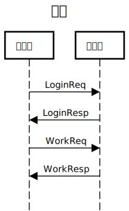

# Secret-Tunnel


## Config

- `global` [doc](https://github.com/starudream/go-lib/blob/v2/README.md) - [example](https://github.com/starudream/go-lib/blob/v2/app.example.yaml)

## Usage

### Server

```
Usage:
  server [flags]
  server [command]

Available Commands:
  client      Manage client
  notify      Manage notify
  service     Manage service
  task        Manage task
  update      Update self

Flags:
      --addr string     server address (default "0.0.0.0:9797")
  -c, --config string   path to config file
  -h, --help            help for server
  -v, --version         version for server

Use "server [command] --help" for more information about a command.
```

```shell
sts --addr 0.0.0.0:9797
```

### Client

```
Usage:
  client [flags]
  client [command]

Available Commands:
  service     Manage service
  update      Update self

Flags:
      --addr string     server address (default "127.0.0.1:9797")
  -c, --config string   path to config file
      --dns string      dns server (default "119.29.29.29:53")
  -h, --help            help for client
      --key string      auth key
  -v, --version         version for client

Use "client [command] --help" for more information about a command.
```

#### Send

```shell
stc --addr 127.0.0.1:9797 --key 9559c307f11f48a88caf42ea5b7844a9
```

#### Recv

- `env` ( use `task` env, such as `APP__TASK1__` `APP__TASK2__` )

```shell
export APP__TASK1__NAME="test"
export APP__TASK1__ADDRESS="127.0.0.1:8081"
export APP__TASK1__SECRET="foo"
```

- `file`

```yaml
tasks:
  - name: test
    address: 127.0.0.1:8081
    secret: 3f6f694825e749ac92ced6f6688f9d9c
```

```shell
stc --addr 127.0.0.1:9797 --key 6df6dc28bf804d18acc2d43e9f429e3c
```

## Message

### Login



### Tunnel


## [License](./LICENSE)
